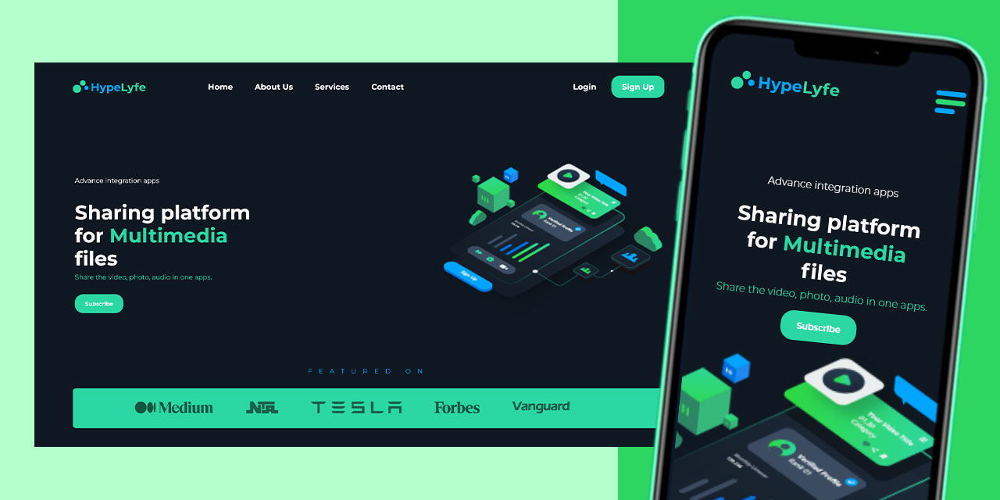

# HypeLyfe - Multimedia Lyfestyle

## Table of contents

- [Overview](#overview)
- [Screenshot](#screenshot)
- [Links](#links)
- [My process](#my-process)
- [Built with](#built-with)
- [Author](#author)

## Overview

This is a personal project i felt like completing and write a code for, i appreciate your feed backs.

### The challenge

Users should be able to:

- View the optimal layout depending on their device's screen size
- See hover states for interactive elements

### Screenshot

### Links

- GitHub URL: [GitHub Repository](https://github.com/DevUKay/Website_Hero-Design_Challenge.git)

- Live Site URL: [Click HERE](https://devukay.github.io/My-First-Website_FrontPage-Design/)

### Built with

- Semantic HTML5 markup
- CSS custom properties
- Flexbox
- CSS Grid
- Mobile-first workflow

### What I learned

Advanced CSS Properties
CSS Grid

### Continued development

The Initial plan was to create just a hero section and then the following day i thought, why not design the entire page, so i design a layout mockup with figma, and tried to code it, i think i did a good job ;) ...it's my first full page design in HTML and CSS...i am just getting started.

## Author

- Twitter - [Follow the Developer](https://twitter.com/kingkayyy)
